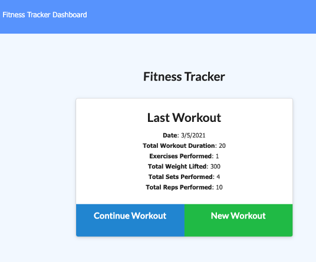

# FitnessTracker

Personal Fitness tracker that allows the user to create and display completed fitness activities.

## Description

This project uses Mongoose, Express and Morgan for logging.

## Table of Contents

- [NPM Packages used](#NPM-Packages)
- [Installation](#installation)
- [Usage](#usage)
- [Deployment](#Deployment)
- [Functionality](#Functionality)
- [Contributing](#Contributing)
- [Questions](#Questions)

## NPM-Packages

[Mongoose](https://www.npmjs.com/package/mongoose)
[Express](https://www.npmjs.com/package/express)
[Morgan](https://www.npmjs.com/package/morgan)

## Installation

If you clone the repository and run:

> npm i

all required npm packages will be installed. Once installation is complete then start the application with:

> nodemon start

To seed the database, MongoDB needs to be running and accessible then use the following command:

> npm run seed

## Usage

User has ability to add 2 types of workout activities including Cardio or Resistance training. The Stats page displayes the last 7 days of workouts in graph format.

## Deployment

Heroku: https://obscure-tundra-84475.herokuapp.com/

## Badges

## Contributing

## Questions

If you have any questions about the project, please reach out at (https://www.linkedin.com/in/jerifey/)
